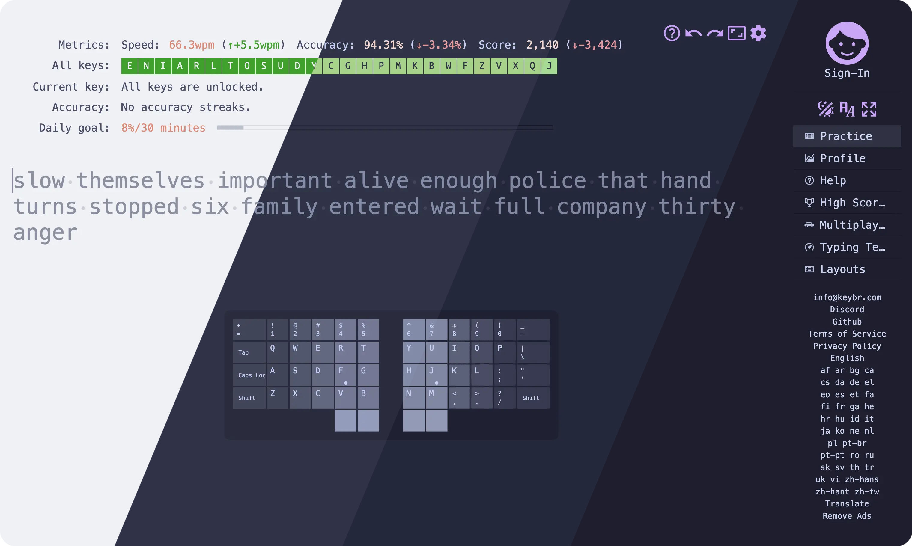
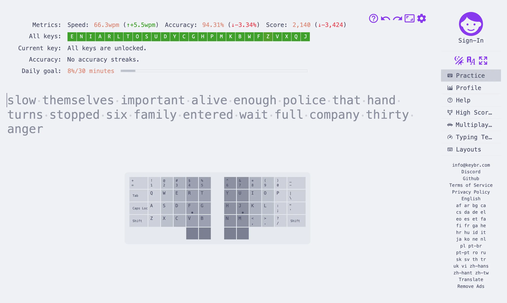
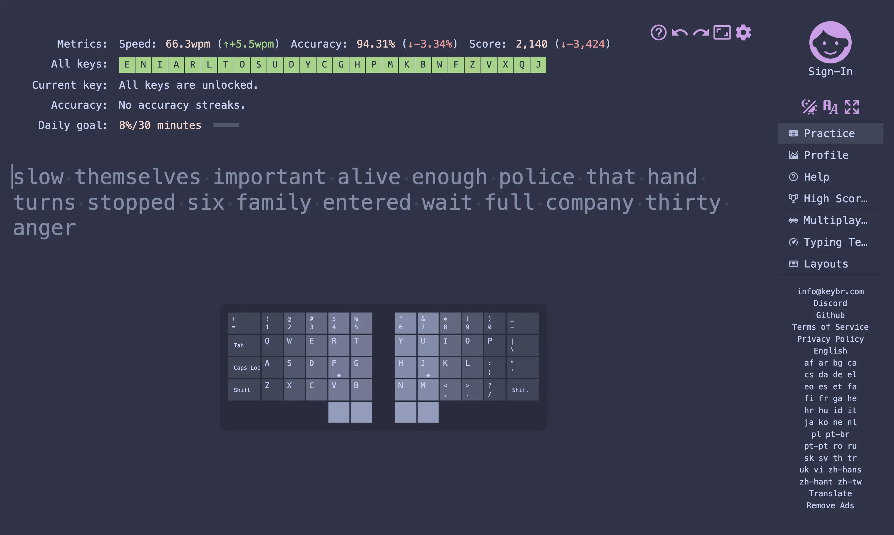
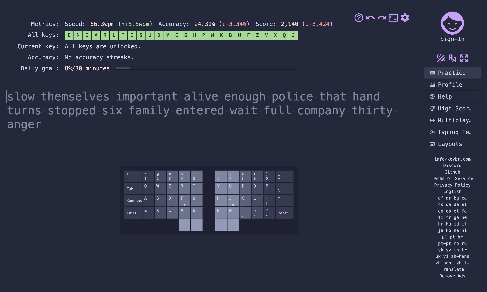
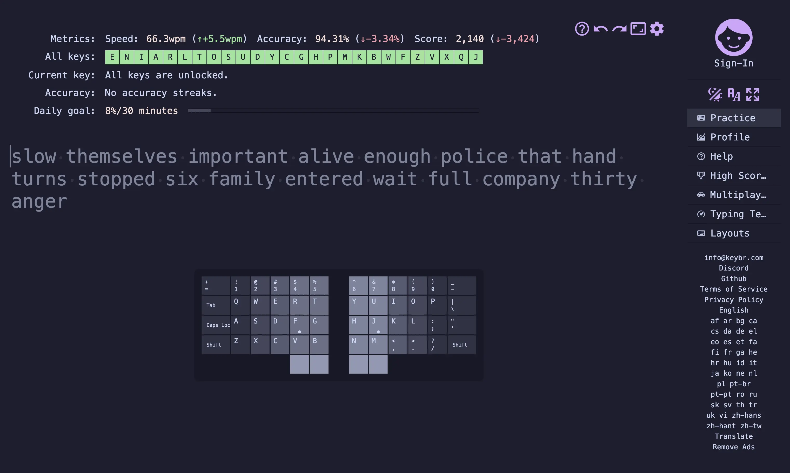

<h3 align="center">
	 
	
	Catppuccin for <a href="https://www.keybr.com/">keybr</a>
	
</h3>

	
	
	

	

## Previews

🌻 Latte

🪴 Frappé

🌺 Macchiato

🌿 Mocha

## Usage

1. Download the flavor of your choice from [Releases](https://github.com/husa/catppuccin-keybr/releases), for example [`mocha.keybr-theme`](https://github.com/husa/catppuccin-keybr/releases/latest/download/mocha.keybr-theme)
2. Open [keybr.com](https://www.keybr.com) and go to **Theme settings(Moon/Sun icon)** > **Custom...** > **Import**
3. Select the downloaded theme file - `mocha.keybr-theme`

<!-- The FAQ section is optional. Remove if needed.-->

<!-- ## 🙋 FAQ -->
<!---->
<!-- - Q: **_"How can I do X?"_**\ -->
<!--   A: ... -->

## 💝 Thanks to

- [husa](https://github.com/husa)

&nbsp;

	

	Copyright &copy; 2021-present <a href="https://github.com/catppuccin" target="_blank">Catppuccin Org</a>

	

